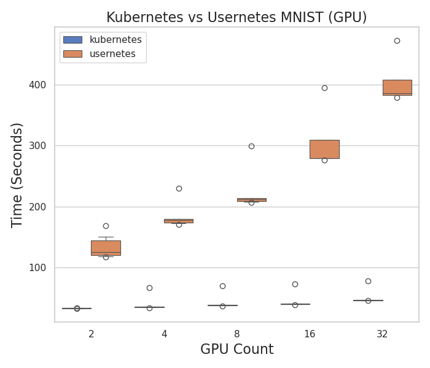

# Testing GKE vs. Usernetes on Compute Engine

This directory has [gke GPU](mnist-gpu) runs to compute GKE with Compute Engine running usernetes. Both use mnist with V100, one per node. We will start at size 2 and scale up as much as we can.
For each, we will do:

- 1 node, 1 GPU/node, batch 128, 4 epochs
- sizes 2, 4, 8, 16, 32 (or to the largest size reasonably possible)
- max MTU (8896)
- The data is pre-pulled to the container so it is not included in the runtime

For each I'll save the complete mnist output from the master runner, and (for the Compute Engine environments where I am working on the physical machine) the lscpu, lspci, and nvidia smi output. Note that while we are testing max mtu (8896) for both, I tested Compute Engine with default (1460) and didn't see a big difference.

## Analysis

You can analyze the data to make plots as follows.

```bash
pip install -r requirements.txt
python 1-run-analysis.py
```

### Time 

The scaling isn't perfect for GKE (it gets slower by ~10 seconds with some outliers) but it does really poorly for Usernetes. It's the same pattern just exacerbated, I think.



### Epoch Stats

The interesting thing here is that they start very close, and get further as the epochs increase. Usernetes actually starts out a little ahead, maybe because it's tag of the same version of pytorch mnist is a little newer. That didn't help it much :)

#### Accuracy


#### Loss


